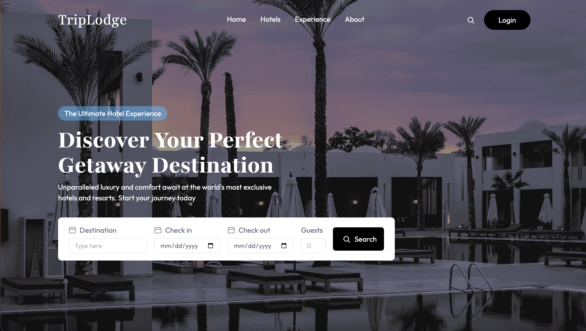

# TripLodge 🏨

A full stack hotel booking app that allows users to browse and book hotel rooms,
manage bookings from an admin dashboard, and receive email booking confirmations.

## 🔗 Links
- **Live App:** [triplodge-delta.vercel.app/](https://triplodge-delta.vercel.app/)

## 📸 Screenshot

## ✨ Features
- User authentication with Clerk
- Browse and book available hotel rooms
- Admin dashboard to manage rooms and bookings
- Add new hotel rooms with images
- Automated booking confirmation emails via Brevo
- Responsive design across all devices

## 🛠 Tech Stack
### Frontend
- React
- Tailwind CSS
- Axios

### Backend
- Node.js
- Express.js
- MongoDB
- Clerk (authentication)
- Brevo (email service)

### Deployment
- Vercel

## 🚀 Getting Started

### Prerequisites
- Node.js
- npm
- MongoDB account
- Clerk account
- Brevo account

### Installation

**Clone the repo:**
git clone https://github.com/eissamonet/TripLodge.git
cd TripLodge

**Install frontend dependencies:**
cd client
npm install

**Install backend dependencies:**
cd ../server
npm install

### Environment Variables

**client/.env:**
VITE_CLERK_PUBLISHABLE_KEY=your_clerk_publishable_key
VITE_API_URL=http://localhost:3000

**server/.env:**
MONGODB_URI=your_mongodb_connection_string
CLERK_SECRET_KEY=your_clerk_secret_key
BREVO_API_KEY=your_brevo_api_key

### Running Locally

**Start the backend:**
cd server
npm start

**Start the frontend:**
cd client
npm run dev

Visit http://localhost:5173 in your browser.
